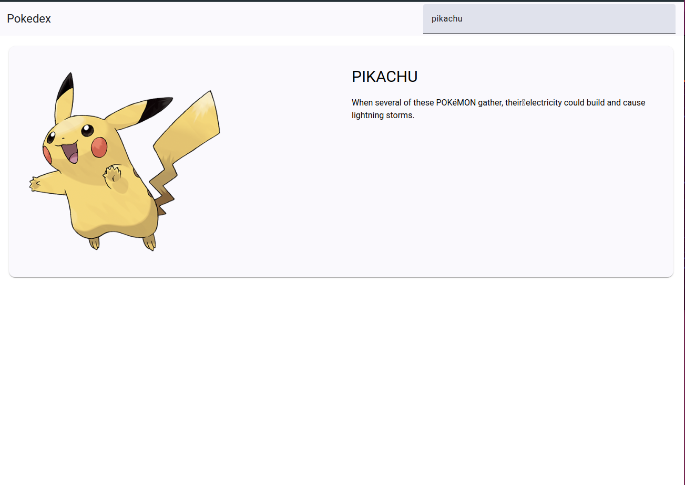
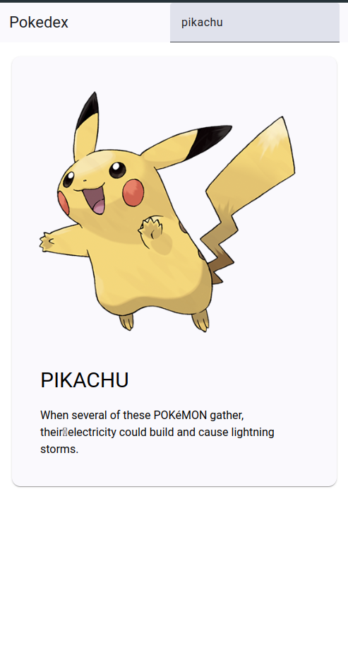

# Simple Training for the SFEIR Playoffs

This project was developed as a training exercise for the SFEIR playoffs.

## Overview

As I am more confident with Angular, I chose to build this project using Angular version 18, leveraging the power of signals for state management. For the design, I integrated **Tailwind CSS** for styling and **Angular Material** for a modern UI component library. The project utilizes the **PokeAPI** for fetching Pokémon data.

## Features

- **Responsive Design**: The application is fully responsive, providing an optimal experience on both desktop and mobile devices.
- **Dynamic Data Fetching**: Utilizes PokeAPI to dynamically load Pokémon data.
- **Interactive UI**: Built with Angular Material components for a seamless user experience.
- **Custom Styling**: Tailwind CSS is used for custom styles, allowing for a modern and clean aesthetic.

## Screenshots

### Desktop

### Mobile

